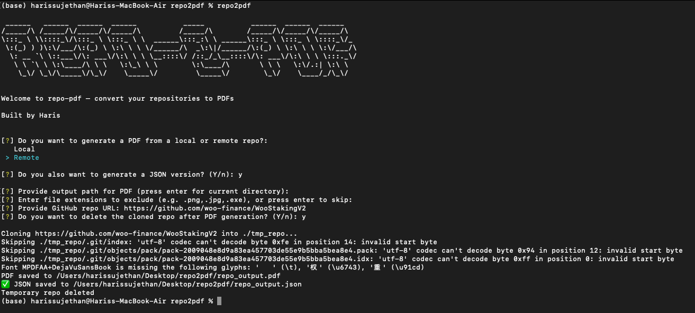

# repo-2-pdf

Convert your repositories into clean PDFs and structured JSON outputs, designed for AI ingestion pipelines but also useful for documentation.

## Features

- 📁 Convert **local** or **remote GitHub repositories**
- 📄 Generate **PDFs** containing full file structures and contents
- 📊 Output structured **JSON summaries** for AI context ingestion
- 🚫 Exclude unnecessary file types automatically

## Installation

### Option 1: Install from PyPI (Recommended)

```bash
pip install repo2pdf
```

### Option 2: Install from Source

Clone the repository and install locally:

```bash
git clone https://github.com/haris-sujethan/repo-2-pdf
cd repo-2-pdf
pip install -r requirements.txt
```

Then choose one of the following:

**Local development install (recommended):**

```bash
pip install -e .
repo2pdf
```

**Run without installing:**

```bash
python -m repo2pdf.cli
```

## Usage

Run the CLI tool:

```bash
repo2pdf
```

**Follow the interactive prompts:**

1. 📂 Select local or remote repository
2. 🔗 Provide the local repo path or GitHub URL
3. 📍 Choose an output location
4. 🚫 Exclude any file types you don't want included (e.g., `.png`, `.jpg`)
5. 📊 Optionally generate a JSON summary alongside the PDF

## Example CLI Flow

The CLI provides an interactive terminal interface that guides you through the conversion process:



## Example Outputs

Example outputs are available in the `/examples` folder:

- **repo_output.pdf** - Clean PDF with full repository structure and file contents
- **repo_output.json** - Structured JSON summary perfect for AI ingestion
